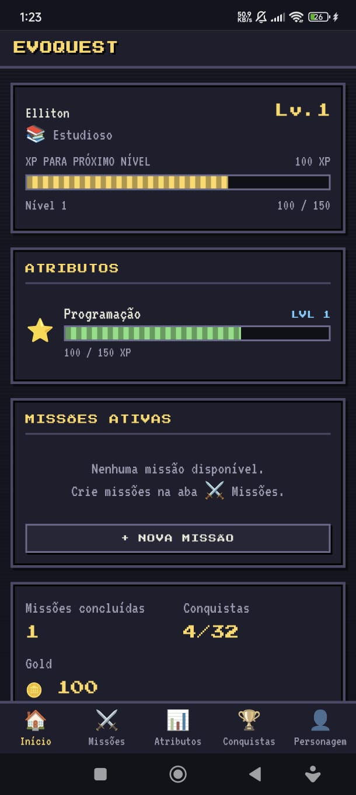
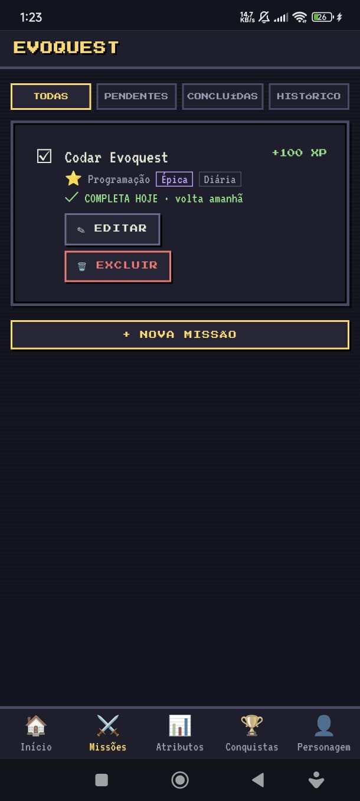
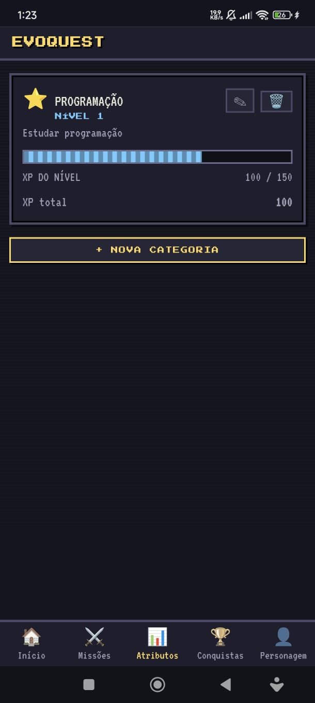
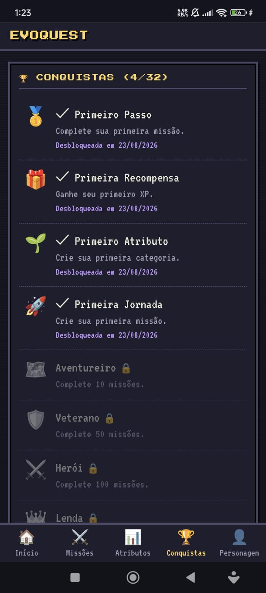
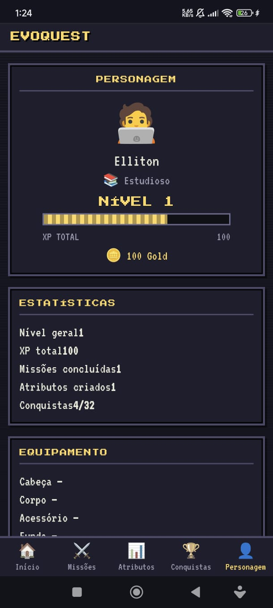

# EvoQuest

> Transforme sua vida em uma aventura.


**EvoQuest** é um Todo List gamificado com estética de RPG retrô. Tarefas e metas da vida real viram **missões**: ao completá-las, você ganha XP nos atributos que você mesmo cria e evolui seu personagem.

Tudo roda no navegador, sem framework, sem backend e sem banco de dados — a persistência é feita inteiramente com `localStorage`.

---

## 🎮 Jogue agora

**Sua vida. Suas missões. Seu RPG.**

👉 **[Jogar EvoQuest](https://evo-quest.vercel.app/)**

Desenvolvido com abordagem **mobile-first**. Instale direto pelo navegador e tenha o EvoQuest na tela inicial do seu celular, como um app — sem baixar nada de loja. Seu progresso é salvo localmente no dispositivo.

### Capturas de tela

| Início | Missões | Estatísticas |
|---|---|---|
|  |  |  |

| Conquistas | Personagem |
|---|---|
|  |  |

---

## 📖 Sobre o projeto

EvoQuest nasceu como um projeto pessoal para explorar três coisas: **gamificação**, **interfaces retrô** e **desenvolvimento frontend com JavaScript puro**.

A premissa: listas de tarefas comuns não dão sensação de progresso. Em um RPG, cada ação gera XP, cada XP enche uma barra e cada barra cheia vira um level up. O EvoQuest aplica essa lógica à vida real — o esforço cotidiano vira progressão visível, e ver o próprio atributo subir de nível costuma ser o empurrão que uma lista de tarefas comum não dá.

É também um exercício de contenção: nada de frameworks, bibliotecas de animação ou abstrações desnecessárias — apenas HTML, CSS, Vanilla JS e as APIs nativas do navegador. **Boa arquitetura > quantidade de funcionalidades. Simplicidade > abstração.**

---

## ✨ Funcionalidades

- [x] Criação de personagem (nome e classe sugerida ou totalmente personalizada);
- [x] **Zero categorias pré-definidas** — o jogador cria os atributos que representam a própria vida (nome, ícone, descrição; criação/edição/exclusão);
- [x] Exclusão de categoria nunca apaga missões: manter sem categoria ou reatribuir;
- [x] Missões com título, descrição, categoria, dificuldade, frequência e XP (automático por dificuldade ou personalizável);
- [x] Perfil do personagem com avatar, estatísticas derivadas e edição (nome/classe/avatar);
- [x] Avatares básicos escolhíveis + avatares cosméticos na loja;
- [x] **Gold**: moeda ganha por missão, com bônus de level up e conquista;
- [x] 🛒 Loja exclusivamente cosmética (avatar, cabeça, corpo, acessórios, fundos), com raridades e itens desbloqueados por conquista;
- [x] Inventário com equipar/desequipar; economia à prova de duplicação;
- [x] 📜 **Regrinhas**: compromissos recorrentes com streak e penalidade em Gold ao quebrar;
- [x] Sistema de XP por atributo e nível geral do personagem, com animações de level up;
- [x] 32 conquistas desbloqueáveis automaticamente (sistema data-driven);
- [x] Estatísticas derivadas de uma única fonte de verdade;
- [x] Persistência versionada em `localStorage` com migração automática;
- [x] Interface responsiva mobile-first (320px+), com toasts, barras animadas, overlays em fila e suporte a `prefers-reduced-motion`.

---

## 🔄 Como funciona

```text
Criar categorias → Criar missão → Escolher dificuldade/frequência
      ↓
Completar missão → ✓ Feedback → +XP → Barra anima
      ↓
Level Up? → ✨ LEVEL UP!
      ↓
Nova conquista? → 🏆 DESBLOQUEADA
```

### Dificuldade

| Dificuldade | XP padrão |
|---|---|
| Fácil | 10 |
| Normal | 25 |
| Difícil | 50 |
| Épica | 100 |

Selecionar uma dificuldade preenche o XP automaticamente; alterar o valor manualmente tem prioridade. Há também a opção **Personalizada**, só com o campo de XP livre.

### Frequência

Uma missão é uma **definição**, nunca duplicada no save. O sistema consulta o histórico de conclusões para decidir se ela está disponível:

| Frequência | Regra |
|---|---|
| Uma vez | Concluída apenas uma vez |
| Diária | Uma vez por dia — "✓ COMPLETA HOJE · volta amanhã" |
| Semanal | Uma vez por semana |
| Mensal | Uma vez por mês |

Cada conclusão gera uma entrada no histórico (`completions`), preservando quando foi feita, quanto valeu e permitindo futuras estatísticas.

### Categorias

Nenhum atributo vem pronto: você cria os seus (Estudos, Leitura, Exercícios, Projetos...). Renomear ou trocar o ícone não afeta XP nem missões. Ao excluir uma categoria com missões vinculadas, o app pergunta o que fazer:

```text
O que deseja fazer com as missões?

( ) Manter missões sem categoria
( ) Reatribuir para outra categoria
( ) Cancelar
```

### Nível geral

Todo XP ganho em qualquer categoria também soma no personagem. A fórmula é previsível:

```text
XP necessário para subir de nível = 100 + (nível atual × 50)
```

O XP histórico nunca é apagado; a barra mostra apenas o progresso dentro do nível atual.

---

## 📜 Regrinhas

Regrinhas são **compromissos recorrentes** — diferentes das Missões:

```text
⚔️ MISSÃO    → realizar algo           → ganha XP e Gold
📜 REGRINHA  → manter um comportamento → preserva o Streak
```

Cada regrinha tem nome, descrição opcional, categoria opcional, frequência (diária/semanal/mensal), **penalidade em Gold** e horário limite opcional (diárias).

A lógica é baseada no **não cumprimento**: você não precisa marcar como concluído todos os dias. Enquanto nenhum período terminar vazio, o streak continua — e o botão `✓ CUMPRIR` existe para registrar explicitamente. Quando um período termina sem registro:

```text
❌ REGRA QUEBRADA
Streak: 14 → 0 · Penalidade: -10 🪙
```

A verificação é *lazy* (roda ao abrir o app/renderizar a aba) — sem cron nem timers. Cada quebra é penalizada uma única vez.

---

## 🪙 Gold e Loja

Completar missões rende **Gold**, conforme a dificuldade:

| Dificuldade | Gold |
|---|---|
| Fácil | 5 |
| Normal | 10 |
| Difícil | 20 |
| Épica | 40 |

Bônus: level up de categoria (+25), level up geral (+50) e conquista desbloqueada (+15). Nada é duplicado: a conclusão é registrada no histórico antes das recompensas, então recarregar a página ou reconcluir uma missão nunca gera Gold extra.

A **🛒 Loja** é exclusivamente cosmética — avatares, cabeça, corpo, acessórios e fundos. Itens são definidos por dados (`SHOP_ITEMS` em `js/game/shop.js`) com raridade visual:

```text
Comum 50 · Incomum 100 · Raro 250 · Épico 500 · Lendário 1000
```

Alguns itens não se compram: são desbloqueados por conquistas e aparecem como 🔒 BLOQUEADO até que o requisito seja cumprido. O inventário permite equipar e desequipar; nada disso afeta XP ou gameplay.

---

## 🏆 Conquistas

32 conquistas desbloqueadas automaticamente, todas declarativas (`ACHIEVEMENT_DEFS` em `js/game/achievements.js`) — adicionar uma nova é acrescentar uma entrada com uma condição:

- **Missões**: Primeiro Passo (1) · Aventureiro (10) · Veterano (50) · Herói (100) · Lenda (1.000) · Mito (5.000)
- **XP**: Primeira Recompensa (1) · Colecionador de XP (1.000) · Tesouro (5.000) · Fortuna (10.000) · Montanha de XP (50.000)
- **Níveis**: Evolução (nv.2) · Veterano de Atributo (nv.5) · Mestre (nv.10) · Grande Mestre (nv.20)
- **Diversidade**: Primeiro Atributo · Especialista (nv.10) · Generalista (3 categorias) · Polímata (5 categorias) · Mestre em Tudo (nv.5 em 5 categorias)
- **Recorrência**: Rotina (diárias em 7 dias distintos) · Constância (semanais em 4 semanas) · Ciclo Completo (mensais em 3 meses)
- **Exploração**: Primeira Jornada · Arsenal de Missões (10) · Planejador (25) · Estrategista (50)
- **Especiais**: Primeiro Level Up · Multiclasse (progresso em 3 atributos) · Colecionador (10 conquistas) · Caçador de Conquistas (25) · Lenda Viva (todas)

---

## 🛠️ Tecnologias

| Tecnologia | Papel |
|---|---|
| **HTML5** | Estrutura das telas e navegação |
| **CSS3** | Estética RPG retrô, responsividade mobile-first e animações |
| **JavaScript (Vanilla)** | Lógica do jogo, estado central e manipulação do DOM |
| **localStorage** | Persistência dos dados no navegador |

Zero dependências de código. As fontes pixeladas (Press Start 2P e VT323) são carregadas via Google Fonts, com fallback monoespaçado.

---

## 🏗️ Arquitetura

Lógica de negócio ≠ persistência ≠ interface:

```text
Interface (ui/*, app.js)
   ↓
Game Logic (game/*, state.js)
   ↓
Estado central (single source of truth)
   ↓
Local Storage (storage.js)
```

```text
evoquest/
├── index.html              # shell + ordem de carregamento
├── css/
│   └── style.css           # tema retrô, responsividade, animações
├── js/
│   ├── storage.js          # persistência versionada + migrações
│   ├── state.js            # estado central, estatísticas derivadas, completeQuest
│   ├── game/
│   │   ├── xp.js           # fórmulas de XP/nível (funções puras)
│   │   ├── categories.js   # CRUD de categorias (exclusão nunca apaga missões)
│   │   ├── quests.js       # dificuldades, recorrência, disponibilidade
│   │   ├── achievements.js # conquistas data-driven
│   │   ├── shop.js         # itens cosméticos, raridades, compra/equip
│   │   └── regras.js       # regrinhas: streak, quebras e penalidades
│   └── ui/
│       ├── screens.js      # renderização das telas
│       ├── modals.js       # modais (missão, categoria, exclusão segura)
│       └── notifications.js# toasts, overlays, animação das barras
├── test-core.js            # testes headless da lógica
└── test-ui.js              # smoke test de interface (requer jsdom)
```

O estado é um único objeto serializável — contadores deriváveis não são armazenados:

```javascript
{
    version: 5,
    player: { name, class, customClass, avatarId, createdCategory, level, totalXp },
    categories: [{ id, icon, name, description, xp, createdAt }],
    quests: [{ id, title, description, categoryId, difficulty, xp, recurrence, createdAt }],
    completions: [{ id, questId, recurrence, xp, at }],  // fonte da verdade do histórico
    achievements: [{ id, unlockedAt }],
    wallet: { gold },
    inventory: { owned: [], equipped: { avatar, head, body, accessory, background } },
    regras: [{ id, title, description, categoryId, frequency, penalty, deadline,
               streak, brokenCount, goldLost, records }]
}
```

Saves antigos (v1 a v4) são **migrados automaticamente** ao carregar (`Storage.migrate`): missões ganham os novos campos, o histórico é reconstruído e nenhum progresso é perdido.

---

## 💾 Persistência

- Sem backend e sem conta de usuário;
- Todos os dados ficam no `localStorage` do seu navegador;
- Fechar e reabrir mantém todo o progresso;
- Limpar os dados de navegação **apaga** o progresso;
- Não há sincronização entre dispositivos;
- Na tela do personagem existe **"Reiniciar aventura"**, que apaga o save permanentemente.

---

## 🚀 Como executar

Sem build e sem dependências obrigatórias.

**Opção 1 — abrir direto**

```bash
git clone <url-do-repositorio>
cd evoquest
```

e abrir o `index.html` no navegador.

**Opção 2 — servidor local (recomendado)**

```bash
python3 -m http.server 8000
```

e acessar `http://localhost:8000`.

No primeiro acesso você cria o personagem e, em seguida, os atributos que representam sua vida — o app começa vazio de propósito.

**Testes:**

```bash
node test-core.js                          # testes headless da lógica
npm install --no-save jsdom && node test-ui.js  # smoke test de interface
```

---

## 🗺️ Roadmap

Ideias para o futuro — nada disso existe ainda:

- [ ] Sprites/imagens no lugar dos avatares emoji;
- [ ] Mais itens cosméticos e efeitos visuais de fundo;
- [ ] Metas de frequência nas regrinhas (ex.: 3× por semana);
- [ ] Estatísticas e gráficos de evolução;
- [ ] Bosses e desafios;
- [ ] Classes com habilidades próprias;
- [ ] PWA;
- [ ] Notificações;
- [ ] Sincronização em nuvem;
- [ ] Exportar/importar save.

---

## 🤝 Contribuindo

Projeto pessoal, mas sugestões, issues e pull requests são bem-vindos. Se contribuir, mantenha o espírito do MVP: simplicidade primeiro.

---

## 📄 Licença

A licença ainda não foi definida.