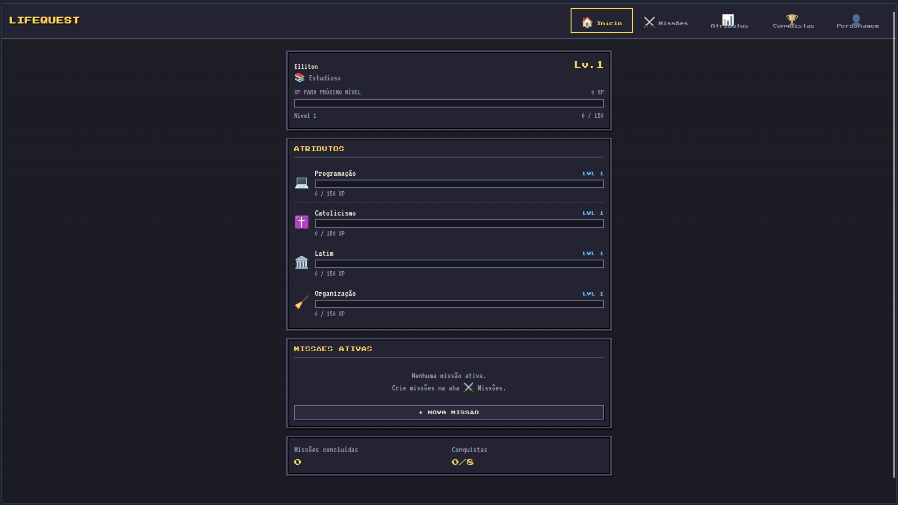
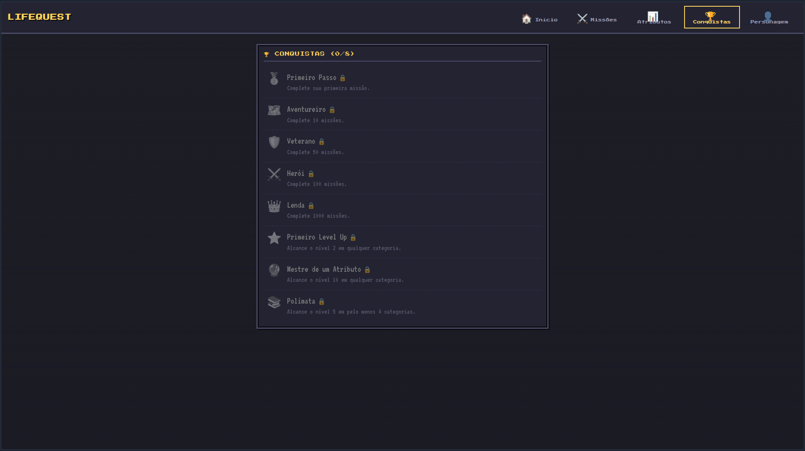

# LifeQuest

> Transforme sua vida em uma aventura.


**LifeQuest** é um Todo List gamificado com estética de RPG retrô. Tarefas e metas da vida real viram **missões**: ao completá-las, você ganha XP nos atributos correspondentes e evolui seu personagem.

Tudo roda no navegador, sem framework, sem backend e sem banco de dados — a persistência é feita inteiramente com `localStorage`.

---

## 📖 Sobre o projeto

LifeQuest nasceu como um projeto pessoal para explorar três coisas que gosto: **gamificação**, **interfaces retrô** e **desenvolvimento frontend com JavaScript puro**.

A premissa é simples: listas de tarefas comuns não dão nenhuma sensação de progresso. Em um RPG, cada ação gera XP, cada XP enche uma barra e cada barra cheia vira um level up. O LifeQuest aplica essa mesma lógica à vida real — estudar, praticar fé, organizar a casa — transformando o esforço cotidiano em progressão visível.

É também um exercício deliberado de contenção: um MVP construído só com HTML, CSS e Vanilla JS, priorizando o loop central do jogo antes de qualquer funcionalidade extra.

---

## 🎮 Demonstração





---

## ✨ Funcionalidades

- [x] Criação de personagem (nome e classe, com sugestões ou classe totalmente personalizada);
- [x] Cinco telas: Início, Missões, Atributos, Conquistas e Personagem;
- [x] Categorias personalizáveis: criar, editar (nome, ícone, descrição) e excluir;
- [x] Criação, edição e exclusão de missões;
- [x] Conclusão e reabertura de missões;
- [x] Sistema de XP por categoria e XP geral do personagem;
- [x] Sistema de níveis com fórmula previsível;
- [x] Level Up de atributos e geral, com animações;
- [x] 22 conquistas desbloqueáveis automaticamente;
- [x] Histórico de XP total e contadores de missões concluídas;
- [x] Persistência completa com `localStorage`, com migração automática de saves antigos;
- [x] Interface responsiva (mobile-first, funciona a partir de 320px);
- [x] Feedback visual: toasts, barras de XP animadas, overlays e microinterações;
- [x] Suporte a `prefers-reduced-motion`.

---

## 🔄 Como funciona

O coração do jogo é este loop:

```text
Criar missão
      ↓
Completar missão
      ↓
Receber XP
      ↓
Evoluir atributo
      ↓
Level Up
      ↓
Desbloquear conquistas
```

Cada categoria da vida é um **atributo** com nível próprio — e nenhuma delas é fixa: é possível renomear, trocar o ícone, descrever ou remover qualquer categoria sem perder o XP já conquistado. Uma missão pertence a exatamente uma categoria e vale a quantidade de XP que você definir:

```text
Missão:
Estudar JavaScript por 1 hora

Categoria:
💻 Programação

Recompensa:
+30 XP

Resultado:
Programação Lv. 4 → Lv. 5
```

Ao concluir uma missão:

1. O XP é somado ao **atributo** e ao **personagem** (nível geral);
2. Os contadores de missões concluídas são atualizados;
3. O sistema verifica se houve level up;
4. Verifica se alguma conquista foi desbloqueada;
5. Exibe as recompensas na tela, na ordem.

### Fórmula de XP

```text
XP necessário para subir de nível = 100 + (nível atual × 50)
```

O XP nunca é apagado: o histórico fica guardado e a barra de progresso mostra apenas o quanto falta dentro do nível atual.

Reabrir uma missão concluída **não remove** o XP já ganho — decisão intencional para manter a simplicidade do MVP.

---

## 🏆 Conquistas

As conquistas são desbloqueadas automaticamente conforme sua progressão:

| Conquista | Condição |
|---|---|
| 🥇 Primeiro Passo | Completar a primeira missão |
| 🗺️ Aventureiro | Completar 10 missões |
| 🛡️ Veterano | Completar 50 missões |
| ⚔️ Herói | Completar 100 missões |
| ⚔️ Centurião | Completar 250 missões |
| 💯 Incansável | Completar 500 missões |
| 👑 Lenda | Completar 1000 missões |
| ⭐ Primeiro Level Up | Alcançar nível 2 em qualquer categoria |
| 🔮 Mestre de um Atributo | Alcançar nível 10 em qualquer categoria |
| 🌟 Primeiro Mestre | Alcançar o nível 10 em qualquer categoria |
| 🧠 Mestre do Conhecimento | Nível 10 em duas categorias diferentes |
| 📚 Polímata | Alcançar nível 5 em pelo menos 4 categorias |
| 🌐 Generalista | Ter pelo menos 5 categorias criadas |
| 💰 Acumulador de XP | Acumular 1.000 XP total |
| 💎 Tesouro de XP | Acumular 5.000 XP total |
| 👑 Senhor da Aventura | Alcançar o nível geral 10 |
| 🎖️ Veterano de Guerra | Completar missões em 4 categorias diferentes |
| 🧭 Explorador | Criar a primeira categoria personalizada |
| 🎭 Identidade Própria | Definir uma classe personalizada |
| 🏆 Colecionador | Desbloquear 10 conquistas |
| 🏅 Caçador de Conquistas | Desbloquear 20 conquistas |
| 🌠 Lenda Viva | Desbloquear todas as outras conquistas |

O sistema foi projetado como uma lista de definições declarativas (`ACHIEVEMENT_DEFS` em `js/game.js`): cada conquista tem nome, ícone, descrição e uma função de verificação — adicionar novas conquistas é questão de acrescentar entradas à lista.

---

## 🛠️ Tecnologias

| Tecnologia | Papel |
|---|---|
| **HTML5** | Estrutura das telas e navegação |
| **CSS3** | Estética RPG retrô, layout responsivo mobile-first e animações |
| **JavaScript (Vanilla)** | Lógica do jogo, estado central e manipulação do DOM |
| **localStorage** | Persistência dos dados no navegador |

Nenhum framework frontend, nenhum backend, nenhuma dependência externa de código. As fontes pixeladas (Press Start 2P e VT323) são carregadas via Google Fonts, com fallback para monoespaçada.

---

## 🏗️ Arquitetura

A separação principal é entre **lógica do jogo** e **interface**:

```text
Interface (ui.js / app.js)
   ↓
Game Logic (game.js)
   ↓
Estado central
   ↓
Local Storage (storage.js)
```

```text
lifequest/
├── index.html        # shell da aplicação
├── css/
│   └── style.css     # tema retrô e responsividade
├── js/
│   ├── storage.js    # leitura/gravação no localStorage
│   ├── game.js       # regras: XP, níveis, missões, conquistas
│   ├── ui.js         # renderização das telas, modais e feedbacks
│   └── app.js        # bootstrap e eventos
├── test-core.js      # testes headless da lógica do jogo
└── test-ui.js        # smoke test de interface (requer jsdom)
```

Todo o estado vive em um único objeto serializável:

```javascript
{
    version: 2,
    player: { name, class, customClass, createdCustomCategory, level, totalXp, completedCount },
    categories: [{ id, icon, name, desc, xp, completedCount }],
    quests: [{ id, name, desc, categoryId, xp, done }],
    achievements: [{ id, unlockedAt }]
}
```

Saves de versões antigas são **migrados automaticamente** ao carregar (`Storage.migrate` em `js/storage.js`) — nenhum progresso é perdido entre atualizações.

Para rodar os testes da lógica (sem navegador):

```bash
node test-core.js
```

Há também um smoke test de interface com DOM real (`test-ui.js`), que simula o fluxo completo do MVP — criação de personagem, missões, XP e persistência. Ele usa `jsdom` como dependência opcional de desenvolvimento:

```bash
npm install --no-save jsdom
node test-ui.js
```

---

## 💾 Persistência

- Não existe backend nem conta de usuário;
- Todos os dados ficam salvos no `localStorage` do seu navegador;
- Fechar e reabrir o aplicativo mantém todo o progresso;
- Limpar os dados de navegação do navegador **apaga** o progresso;
- Os dados não sincronizam entre dispositivos — cada navegador tem seu próprio save.

Na tela do personagem existe a opção **"Reiniciar aventura"**, que apaga o save permanentemente.

---

## 🚀 Como executar

Não há build nem dependências. Duas opções:

**Opção 1 — abrir direto**

Baixe ou clone o projeto e abra o `index.html` no navegador:

```bash
git clone <url-do-repositorio>
cd lifequest
```

**Opção 2 — servidor local (recomendado)**

Alguns recursos, como fontes web, funcionam de forma mais confiável via HTTP:

```bash
python3 -m http.server 8000
```

Depois acesse `http://localhost:8000`.

No primeiro acesso, o aplicativo pede a criação do seu personagem. Depois disso, o painel abre direto com as quatro categorias padrão já criadas.

---

## 🗺️ Roadmap

Ideias para o futuro — nada disso existe ainda:

### 🚧 Próximos passos

- [ ] Avatar personalizável;
- [ ] Sistema de roupas e equipamentos;
- [ ] Inventário;
- [ ] Streaks diários;
- [ ] Missões recorrentes;
- [ ] Bosses e desafios;
- [ ] Classes com habilidades próprias;
- [ ] PWA;
- [ ] Notificações;
- [ ] Sincronização em nuvem;
- [ ] Mais conquistas e sistemas de progressão.

---

## 💭 Filosofia do projeto

Produtividade costuma ser apresentada como obrigação. O LifeQuest parte do oposto: o progresso pessoal pode ser algo visual, tangível e divertido, como em um RPG. Cada tarefa concluída enche uma barra, cada barra vira um level up — e ver o próprio atributo de "Programação" subir de nível é, muitas vezes, o empurrão que uma lista de tarefas comum não dá.

---

## 🤝 Contribuindo

Embora seja um projeto pessoal, sugestões, issues e pull requests são bem-vindos. Se for contribuir, mantenha o espírito do MVP: simplicidade primeiro.
